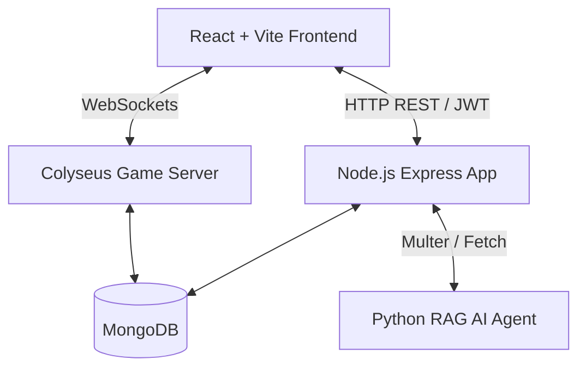

# 🛡️ Hashnet
> **A Realtime Multiplayer RAG/AGENTIC Gamified Coding and Learning Platform**

---

## 📖 Introduction & System Overview

**Hashnet** is an ultra-premium, high-performance, gamified platform designed to revolutionize technical education and interview preparation. By combining **real-time multiplayer gaming mechanics** with **Agentic AI & Retrieval-Augmented Generation (RAG)**, Hashnet changes learning from static study sheets into immersive, cooperative, and competitive gameplay.



At its core, Hashnet features:
1. **Colyseus Game Engine**: Direct real-time client-state synchronization for multiplayer matchrooms, including cooperative boss raids, team matches, and competitive arenas.
2. **RAG-Powered AI Mentor**: Interactive learning powered by custom document uploads. Players can upload slide decks or textbooks to generate custom gaming rooms and receive contextual AI hints.
3. **Monaco Code Arena**: Fully featured editor workspace for algorithm problem-solving with dynamic test execution, real-time score feeds, and interactive leaderboards.

---

## 🎨 Premium Visual Layouts & Design Mockups

Below are the placeholders for visual design. Link your custom screenshots inside the `docs/` folder to populate the preview assets:

```carousel

<!-- slide -->

<!-- slide -->

```

---

## 💻 Tech Stack & Tooling

### Frontend Engine (Client)
| Tech / Library | Description | Purpose |
| :--- | :--- | :--- |
| **React (v19)** | Declarative UI framework | Interactive reactive component management |
| **Vite** | Fast frontend build runner | Super-fast compilation and live HMR |
| **TailwindCSS (v3)** | Utility-first CSS | Sleek, dark mode styles and micro-animations |
| **Zustand** | Minimalist state manager | Global store synchronization (Auth, Room, Game) |
| **Colyseus.js** | WebSocket gaming client | Real-time connection to state-sync matchrooms |
| **Monaco Editor** | Visual Studio Code editor core | Embedded code workspace with syntax highlighting |
| **React Hot Toast** | Toast notification system | Micro-interactions and real-time game status feeds |

### Backend Infrastructure (Server)
| Tech / Library | Description | Purpose |
| :--- | :--- | :--- |
| **Node.js + Express** | Core runtime + router | REST API endpoints, routing, and file handling |
| **TypeScript** | Strongly-typed JavaScript | Compile-time checking and documentation safety |
| **Colyseus Server** | Real-time multiplayer engine | Direct state-synchronization protocol |
| **Mongoose + MongoDB** | Object data modeling | User accounts, leaderboard metrics, custom problems |
| **BcryptJS + JWT** | Password hashing & Token authentication | Secure user login, session management, route protection |
| **Multer** | Multipart parser | Processing uploaded textbooks and RAG files |

---

## 📂 Codebase Directory Structure

```text
Hashnet/
├── client/                     # Frontend Application
│   ├── public/                 # Static Assets (favicon, icons, mode covers)
│   ├── src/
│   │   ├── api/                # Axios instances & REST definitions
│   │   ├── assets/             # Images and design layouts
│   │   ├── colyseus/           # GameClient configuration
│   │   ├── components/         # Global shared components (Reconnector, Toast, etc.)
│   │   ├── hooks/              # Custom React Hooks (useBattle, useRoom, useTeams, useCompetitive)
│   │   ├── pages/              # Individual Page Views (BattlePage, CreateRoomPage, BossRaidPage)
│   │   ├── routes/             # App routing configuration
│   │   ├── store/              # Zustand global state definitions
│   │   └── types/              # TS interface declarations
│   ├── package.json
│   └── vercel.json             # Vercel Single-Page Application (SPA) routing configuration
├── server/                     # Backend API & WebSocket Server
│   ├── src/
│   │   ├── config/             # DB & App server initialization configs
│   │   ├── controllers/        # Express route handler methods
│   │   ├── middleware/         # JWT Auth verify & Admin validation checks
│   │   ├── models/             # Mongoose schemas (User, Problem, Question, run logs)
│   │   ├── rooms/              # Colyseus multiplayer rooms logic
│   │   │   └── schema/         # Game states synchronized in real-time
│   │   ├── routes/             # REST Route mappings (Auth, Quiz, Problems, RAG, Admin)
│   │   ├── services/           # External API utilities (e.g. Codeforces, RAG fetcher)
│   │   └── utils/              # Helper functions (room code generators, parser logic)
│   ├── package.json
│   └── tsconfig.json
└── README.md
```

---

## ⚔️ Game Modes & Page Workspaces

### 1. The Coding Workspace (`BattlePage.tsx` / `BossRaidPage.tsx` / `TeamsPage.tsx`)
* Contains the embedded **Monaco Editor**.
* Dynamic code execution framework executing multiple test-cases in real time.
* **Boss Raid mode**: Players combine efforts to write algorithm solutions to chip away the HP of an AI Boss before the timer expires.

### 2. The Quiz Workspace (`QuizPage.tsx` / `QuizTeamsPage.tsx` / `QuizBossRaidPage.tsx`)
* Multiple-choice questions mapped dynamically based on selected categories.
* Instant response grading with multiplayer leaderboard feeds.
* Cooperative modes where squads build combos by answering streaks of questions correctly.

### 3. Setup & Management Lobbies (`CreateRoomPage.tsx` / `LobbyPage.tsx`)
* Customize match options: Select programming language constraints, custom time-limits, difficulty levels, and quiz categories.
* Dynamic lobby rooms where players connect using short 6-digit codes.

---

## ⚙️ Data Schemas & Models

### User Schema (`User.ts`)
* `username`: String (Unique, Indexed)
* `email`: String (Unique)
* `password`: String (Hashed via Bcrypt)
* `isAdmin`: Boolean
* `avatar`: String
* `stats`: Matches played, win ratios, XP levels.

### Problem Schema (`Problem.ts`)
* `title`: String
* `description`: Markdown string
* `difficulty`: Easy / Medium / Hard
* `tags`: Array of strings (e.g. `sliding-window`, `dynamic-programming`)
* `testCases`: Inputs and expected outputs used by the dynamic runtime grader.

---

## 🤖 RAG Engine Details

```text
User TextBook PDF  ──>  POST /api/rag/upload  ──>  Forwards to Python FastAPI RAG
                                                            │
  MongoDB Insert  <──  Express Stores Generated Data  <───  LLM Generates custom Quizzes & Codes
```

1. **Upload & Parse**: The user uploads study materials (like PDFs, TXT files, or course notes).
2. **AI Extraction**: The backend forwards the document to a FastAPI-based RAG service, where a Large Language Model analyzes the document.
3. **Game Room Generation**: The LLM extracts conceptual multiple-choice questions and designs related programming challenges, saving them dynamically in MongoDB under a unique document ID tag.
4. **Custom Category Play**: A player can immediately create a game room, select their uploaded document as the quiz/code category, and play through questions parsed directly from their course materials!

---

## 🔧 Installation & Local Setup

### 1. Clone the project
```bash
git clone https://github.com/VeeraVardhan35/Hashnet.git
cd Hashnet
```

### 2. Configure Backend Service
```bash
cd server
npm install
```
Create a `.env` file inside `server/`:
```env
PORT=2567
MONGO_URI=mongodb+srv://<user>:<password>@cluster.mongodb.net/hashnet
JWT_SECRET=your_super_secure_jwt_secret
FRONTEND_URL=http://localhost:5173
RAG_SERVER_URL=http://localhost:8000
```
Start the development server:
```bash
npm run start
```

### 3. Configure Frontend Service
Open a new terminal window:
```bash
cd client
npm install
```
Create a `.env` file inside `client/`:
```env
VITE_API_URL=http://localhost:2567/api
VITE_WS_URL=ws://localhost:2567
```
Start Vite development server:
```bash
npm run dev
```

---

## 🛡️ Production & Deployment Guidelines

> [!IMPORTANT]
> When deploying frontend or backend updates, ensure that the respective environments are correctly configured to avoid CORS blocks.

* **Vercel Deploy (Frontend)**: The production build outputs to `dist`. Ensure the Framework Preset is set to **Vite** and the Root Directory is set to `client`.
* **Render Deploy (Backend)**: Add the `FRONTEND_URL` environment variable inside your Render service set to your production frontend URL (e.g. `https://hashnet.vercel.app`) to authorize incoming requests.

---

## 👨‍💻 Author & Contributions

Project developed and maintained by **Veeravardhan**.

* **GitHub**: [@VeeraVardhan35](https://github.com/VeeraVardhan35)
* **LinkedIn**: [Veeravardhan](https://linkedin.com/in/Veeravardhan)

---

## 📄 License

This software is distributed under the MIT License. Details can be found in the [LICENSE](LICENSE) file.
