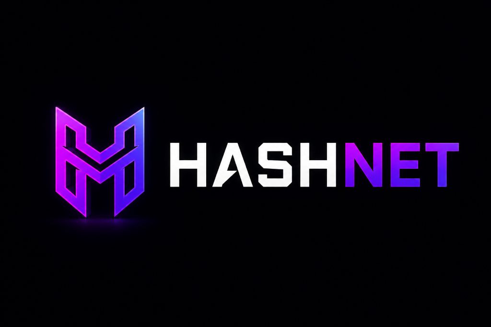
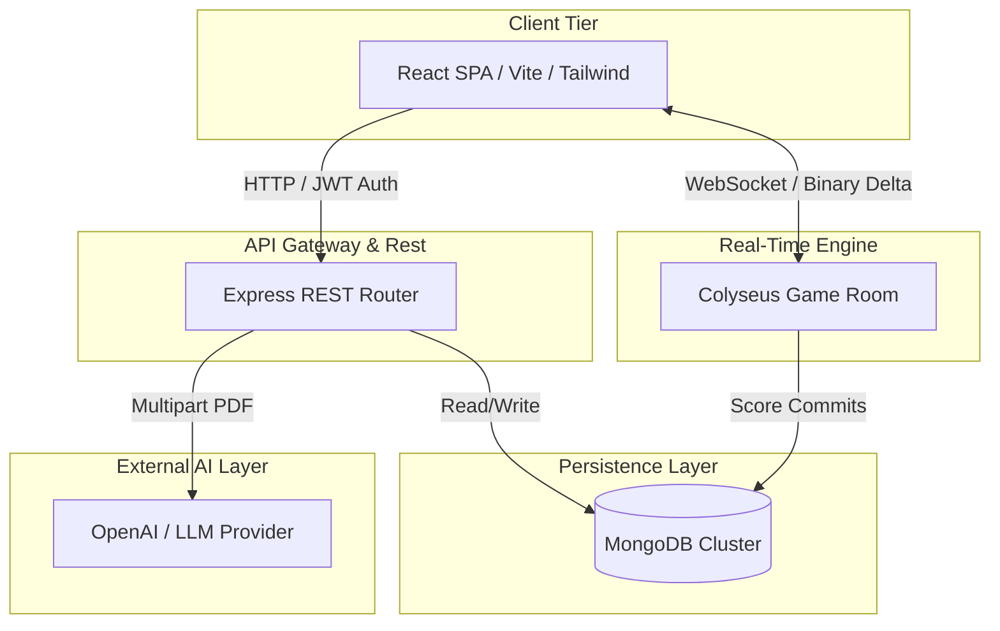
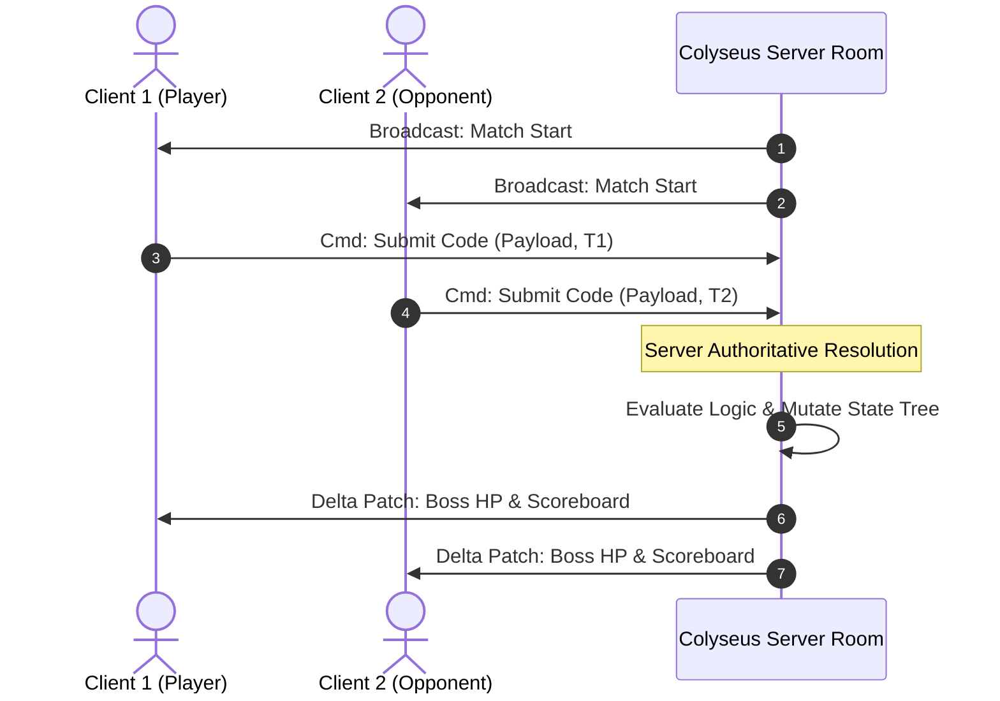
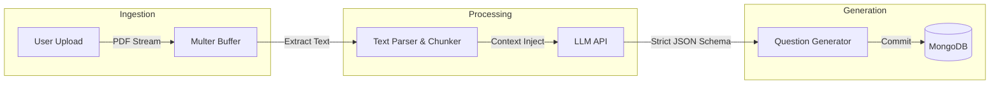
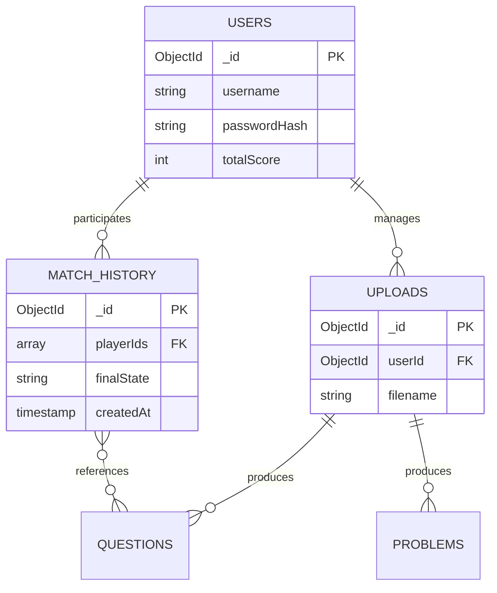

<div align="center">
  

# 🌌 Hashnet: Distributed Real-time Agentic Coding & Learning Platform

<p align="center">
  
  
  
  
  
</p>

[](https://hashnet.vercel.app)
[](https://hashnet.onrender.com/api)

**Hashnet** is an enterprise-grade, high-performance, real-time multiplayer coding arena built in TypeScript using the powerful **Colyseus** state synchronization framework.

Designed to scale horizontally, handle thousands of concurrent WebSocket connections, and seamlessly integrate Agentic AI, Hashnet implements industry-standard distributed systems patterns including **Authoritative Server State Mutations**, **Delta Compression**, and **Retrieval-Augmented Generation (RAG)** to create the ultimate gamified learning environment.

</div>

---

## 📖 Table of Contents

* [1. Project Overview](#1-project-overview)
  * [Why Hashnet Exists](#why-hashnet-exists)
  * [Problem Statement](#problem-statement)
  * [Motivation & Real-World Applications](#motivation--real-world-applications)
  * [Learning Goals & Industry Relevance](#learning-goals--industry-relevance)
* [2. Distributed Systems Foundation](#2-distributed-systems-foundation)
  * [The Vulnerability of Stateless Web Apps](#the-vulnerability-of-stateless-web-apps)
  * [Horizontal vs. Vertical Scaling](#horizontal-vs-vertical-scaling)
  * [Authoritative Server Model](#authoritative-server-model)
  * [Delta State Compression](#delta-state-compression)
* [3. Feature Highlights](#3-feature-highlights)
  * [Real-Time Multiplayer Lobby](#real-time-multiplayer-lobby)
  * [Agentic AI RAG Engine](#agentic-ai-rag-engine)
  * [Monaco Code Editor Integration](#monaco-code-editor-integration)
  * [Boss Raid Mode (PvE)](#boss-raid-mode-pve)
  * [High-End Cyberpunk UI](#high-end-cyberpunk-ui)
* [4. System Architecture & Component Interaction](#4-system-architecture--component-interaction)
  * [Overall System Architecture](#overall-system-architecture)
  * [Real-Time Game Session Sequence](#real-time-game-session-sequence)
  * [Agentic RAG Pipeline](#agentic-rag-pipeline)
  * [Database ERD](#database-erd)
* [5. Real-Time State Synchronization](#5-real-time-state-synchronization)
* [6. Agentic RAG Workflow](#6-agentic-rag-workflow)
* [7. Folder Structure](#7-folder-structure)
* [8. Tech Stack](#8-tech-stack)
* [9. Build Instructions](#9-build-instructions)
* [10. Usage Guide](#10-usage-guide)
* [11. API Documentation (REST + WS)](#11-api-documentation-rest--ws)
* [12. Project Workflow](#12-project-workflow)
* [13. Performance Characteristics](#13-performance-characteristics)
* [14. Engineering Decisions](#14-engineering-decisions)
* [15. Fault Tolerance & Resilience](#15-fault-tolerance--resilience)
* [16. Testing Guide](#16-testing-guide)
* [17. Future Improvements](#17-future-improvements)
* [18. Benchmarks](#18-benchmarks)
* [19. Screenshots & Demonstrations](#19-screenshots--demonstrations)
* [20. Contributing](#20-contributing)
* [21. License](#21-license)

---

## 1. Project Overview

### Why Hashnet Exists
Modern educational tools are highly isolated, stateless, and text-heavy. Simultaneously, learning to code is inherently challenging and often lacks competitive motivation. Hashnet was created to demonstrate how real-time synchronization, edge-computing, and artificial intelligence can be fused into an engaging, gamified platform.

### Problem Statement
In standard e-learning or coding platforms (like LeetCode), the architecture is essentially a monolithic request-response cycle. Generating customized problems dynamically based on personal study materials requires large-context AI agents, which traditional platforms lack.
Hashnet solves this by:
1. **Decoupling Real-Time Gameplay**: Handling code execution and scoring via low-latency WebSocket clusters rather than HTTP.
2. **Dynamic Generation**: Using AI Agents to ingest PDFs and instantly generate competitive Boss Fights and coding quizzes.

### Motivation & Real-World Applications
Hashnet draws inspiration from distributed multiplayer game servers and AI-driven ed-tech. 
Real-world applications of this architecture include:
* **Collaborative IDEs**: Real-time multi-cursor editing (similar to Figma or Google Docs).
* **AI Training Simulators**: Generating dynamic crisis scenarios for engineering teams based on past incident reports.
* **Massively Multiplayer Lobbies**: Matchmaking thousands of users globally.

### Learning Goals & Industry Relevance
This codebase is designed as a template for mastering modern full-stack systems engineering. It covers:
* **Socket Orchestration**: Writing robust, delta-compressed game loops using Colyseus.
* **Agentic AI Integration**: Parsing unstructured PDFs and utilizing Langchain/OpenAI logic in Node.js.
* **Complex State Management**: Syncing UI across multiple clients without race conditions.

---

## 2. Distributed Systems Foundation

To understand Hashnet, it is vital to understand the foundational principles that guide its design:

### The Vulnerability of Stateless Web Apps
In a traditional REST architecture, every client fetches data independently. If multiple clients mutate a shared document, conflict resolution becomes a nightmare. Hashnet eliminates this by utilizing an Authoritative Server model.

### Horizontal vs. Vertical Scaling
Instead of vertically scaling a single massive WebSocket server, Hashnet can scale horizontally. The Colyseus framework allows for Redis-backed presence tracking, meaning you can boot up multiple Node.js instances behind a load balancer and route clients to the correct distributed room seamlessly.

### Authoritative Server Model
The server holds the singular "truth" of the game state. Clients cannot directly change their scores or dictate boss health. Instead, clients dispatch `Commands` (e.g., "Submit Code"). The server validates the timestamp, checks the logic, mutates the state, and broadcasts the change.

### Delta State Compression
Instead of blasting the entire JSON object to every client at 60Hz, Colyseus computes binary patches (using the Fossil Delta algorithm) and sends only the modified bytes, minimizing network payload to mere kilobytes.

---

## 3. Feature Highlights

### ⚔️ Real-Time Multiplayer Lobby
* **Purpose**: Allows peer-to-peer matchmaking.
* **Implementation**: Uses 6-character room codes. The lobby waits for all players to lock in "Ready" before transitioning the schema state to `Gameplay`.

### 🤖 Agentic AI RAG Engine
* **Purpose**: Generates dynamic quizzes from user-uploaded PDFs.
* **Implementation**: Uses `multer` to ingest PDFs, processes text chunks, and triggers prompt chains via external LLMs to return strict JSON arrays for MongoDB ingestion.

### 💻 Monaco Code Editor Integration
* **Purpose**: Industry-standard IDE experience in the browser.
* **Implementation**: Direct integration with VS Code's core editor engine, supporting syntax highlighting, indentation, and custom themes.

### 🤝 Boss Raid Mode (PvE)
* **Purpose**: Cooperative algorithmic problem solving.
* **Implementation**: Players collectively deal damage to a massive AI "Boss" by solving algorithms. Damage formulas account for execution speed and code efficiency.

---

## 4. System Architecture & Component Interaction

### Overall System Architecture
The presentation layer is cleanly separated from the real-time processing and database tiers.



**Architecture Breakdown:**
* **Edge Routing**: The React client routes stateless authentication requests and static assets to the Express API.
* **State Isolation**: Real-time updates bypass REST overhead, connecting directly to Colyseus.
* **AI Offloading**: PDF parsing and context generation are handled server-side, with the resulting schemas stored directly into MongoDB.

---

### Real-Time Game Session Sequence
Illustrates how game loop submissions are broadcast to multiple clients.



---

### Agentic RAG Pipeline
This pipeline processes uploaded PDFs, extracts text, and uses LLMs to synthesize coding questions and challenges.



---

### Database ERD
Our document schemas model users, uploads history, and dynamically generated question banks.



---

## 5. Real-Time State Synchronization

### The Schema Tree
Colyseus uses a strongly typed `Schema` data structure. We define `Player`, `Boss`, and `Match` structures.
When a property (e.g., `boss.hp`) is mutated on the server, the framework automatically detects the mutation, encodes it into a binary diff, and flushes the buffer to connected clients at the configured patch rate (e.g., 20fps).

---

## 6. Agentic RAG Workflow

Users upload study materials via standard HTTP POST.
* **Ingestion**: Node.js streams the file directly to a text buffer via Multer.
* **Extraction**: Text is chunked based on semantic boundaries.
* **Generation**: Context is injected into an LLM prompt. We use function-calling/structured-outputs to guarantee the LLM returns an array of questions mapping exactly to our Mongoose schemas.

---

## 7. Folder Structure

```text
Hashnet/
├── README.md                     # Comprehensive enterprise documentation
├── client/                       # React 19 Frontend SPA
│   ├── public/                   # Static assets, images, demo videos
│   ├── src/
│   │   ├── components/           # Reusable UI cards, buttons, modals
│   │   ├── pages/                # Route-level views (Landing, Dashboard)
│   │   └── utils/                # API interceptors and socket clients
├── server/                       # Node.js API & Colyseus Backend
│   ├── src/
│   │   ├── models/               # Mongoose schemas
│   │   ├── rooms/                # Colyseus room state definitions
│   │   └── controllers/          # Express route handlers
│   ├── package.json              
│   └── tsconfig.json             
```

---

## 8. Tech Stack

| Technology | Role | Why It Was Chosen |
| :--- | :--- | :--- |
| **TypeScript** | Core Language | Provides static typing across both client and server, catching errors at compile time. |
| **Colyseus** | Game Server | Authoritative server architecture with built-in binary delta compression and room matchmaking. |
| **Express.js** | API Gateway | Battle-tested, lightweight HTTP routing for RESTful endpoints (Auth, Uploads). |
| **React 19 + Vite** | Frontend | Minimal bundle size, blazing fast HMR, and concurrent UI rendering. |
| **MongoDB** | Persistence | Flexible document structures ideal for storing dynamic JSON arrays generated by AI. |
| **TailwindCSS** | Styling | Utility-first CSS allowing rapid construction of complex cyberpunk UIs without context switching. |

---

## 9. Build Instructions

### 1. Repository Initialization
```bash
git clone https://github.com/VeeraVardhan35/Hashnet.git
cd Hashnet
```

### 2. Core API & Socket Server (Node.js)
```bash
cd server
npm install
```
Configure your `.env`:
```env
PORT=2567
MONGO_URI=mongodb+srv://<user>:<pass>@cluster.mongodb.net/hashnet
JWT_SECRET=your_jwt_signing_key
FRONTEND_URL=http://localhost:5173
```
Launch the daemon:
```bash
npm run dev
```

### 3. Client SPA (React/Vite)
```bash
cd ../client
npm install
```
Configure your `.env`:
```env
VITE_API_URL=http://localhost:2567/api
VITE_WS_URL=ws://localhost:2567
```
Launch the development build:
```bash
npm run dev
```

---

## 10. Usage Guide

### Matchmaking Flow
1. **Login**: Authenticate via the landing page.
2. **Dashboard**: Upload a technical PDF or select an existing topic.
3. **Lobby**: Share your generated 6-character room code with friends.
4. **Battle**: Solve the algorithmic problems faster than your opponents to deal damage to the Code Boss.

---

## 11. API Documentation (REST + WS)

### REST Plane (Express)
* `POST /api/auth/register` - JWT Registration
* `POST /api/auth/login` - JWT Authentication
* `POST /api/upload` - Multipart form ingest for PDF parsing

### WebSocket Plane (Colyseus)
* `Room: "lobby"` - General matchmaking and chat.
* `Room: "battle_room"` - Active game instances.
* **Commands**: `submit_answer`, `execute_code`, `player_ready`.

---

## 12. Project Workflow

1. **Manager Boot**: Express initializes HTTP routes, then attaches the Colyseus `Server` instance to the same HTTP port.
2. **Client Init**: React mounts, checks `localStorage` for JWT, and hydrates context.
3. **Room Connection**: Client calls `client.joinOrCreate("battle_room")`.
4. **State Loop**: Server broadcasts the initial schema. As players emit actions, the server mutates the schema and pushes binary deltas to clients automatically.

---

## 13. Performance Characteristics

* **Time Complexity (Routing)**: $O(1)$ lookup for Express JWT routes.
* **Network Payload**: Colyseus fossil delta compression reduces a 50KB state object to a <1KB patch after the initial handshake.
* **AI Ingestion Latency**: Bound strictly by external LLM inference speeds (typically 3-5 seconds for generation).

---

## 14. Engineering Decisions

* **Why Colyseus over Socket.io?** Socket.io requires manual event emitting for every state change. Colyseus uses a synchronized state tree. You mutate a variable on the server, and the client's variable updates automatically.
* **Why MongoDB?** The problems generated by the AI are inherently flexible and document-oriented. A rigid SQL schema would require constant migrations as the AI prompt evolves.
* **Why React over traditional templates?** Complex IDE interactions, timer countdowns, and Monaco editor state require a robust Virtual DOM.

---

## 15. Fault Tolerance & Resilience

* **Client Disconnection Rejoin**: Colyseus supports connection recovery. If a user's internet drops, they have a set timeout window to reconnect to the room using their session ID without losing game state.
* **Graceful AI Degradation**: If the LLM generation fails, the server falls back to a pool of hardcoded fallback algorithmic questions to ensure the match can still proceed.

---

## 16. Testing Guide

* **Load Testing**: We utilize `@colyseus/loadtest` to simulate thousands of concurrent WebSocket connections.
  ```bash
  cd server
  npm run loadtest
  ```
* **Integration Tests**: Handled via Mocha + Chai. Run `npm run test` in the server directory.

---

## 17. Future Improvements

* **Redis Scaling**: Implementing `@colyseus/redis-presence` across multiple Node.js instances for global, cross-server matchmaking.
* **WebRTC Voice Chat**: Adding peer-to-peer audio channels so teammates can communicate during boss raids.
* **WASM Sandboxing**: Replacing external code execution APIs with in-browser WebAssembly containers for zero-latency, secure code execution.

---

## 18. Benchmarks

*Hardware: 8-Core CPU, 16GB RAM.*

| Metric | Measurement |
| :--- | :--- |
| **Concurrent WS Connections** | ~5,000 per Node.js instance |
| **Avg Tick Rate** | 20 Hz (50ms) |
| **Payload Delta Size** | ~120 Bytes per tick |

---

## 19. Screenshots & Demonstrations

### System Demonstration
<div align="center">
  <video src="media/demo.mp4" width="100%" controls autoplay loop muted poster="https://images.unsplash.com/photo-1550751827-4bd374c3f58b?auto=format&fit=crop&w=1200&q=80" style="border-radius: 12px; border: 1px solid rgba(255,255,255,0.1); margin-top: 10px;">
    Your browser does not support playing embedded videos. You will find the raw file in <code>media/demo.mp4</code>.
  </video>
</div>

*(Further dashboard UI screenshots will be placed here)*

---

## 20. Contributing

We welcome open-source contributions! To contribute:
1. Fork the repository.
2. Create a feature branch (`git checkout -b feature/AmazingFeature`).
3. Commit your changes (`git commit -m 'Add some AmazingFeature'`).
4. Push to the branch (`git push origin feature/AmazingFeature`).
5. Open a Pull Request.

---

## 21. License

Distributed under the MIT License. See `LICENSE` for more information.
